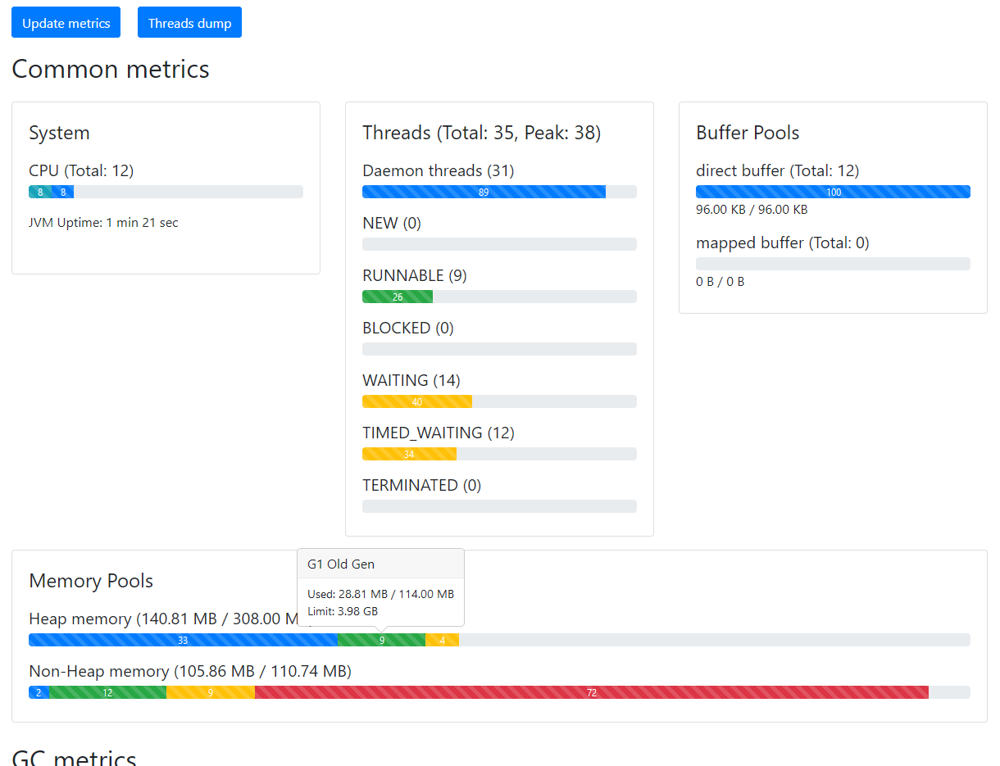
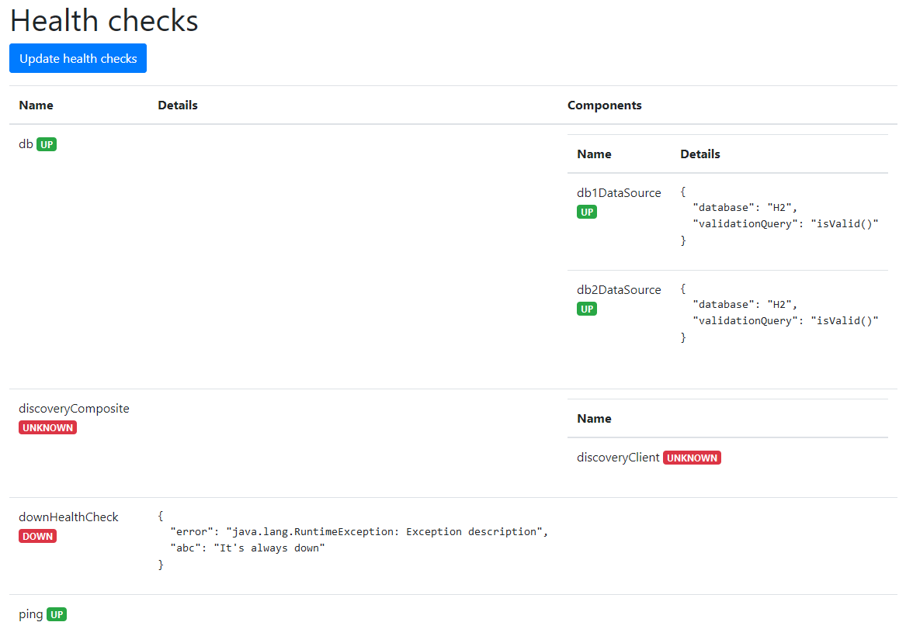
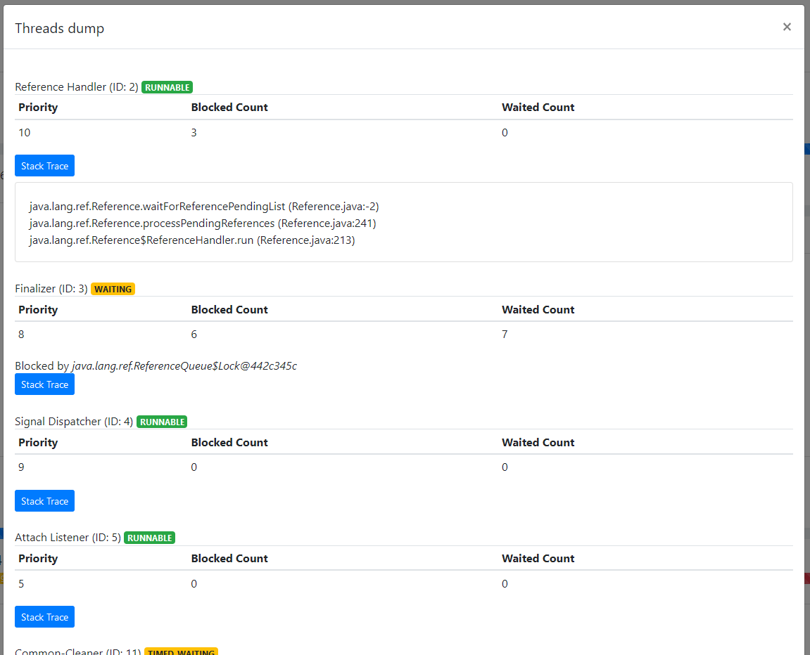
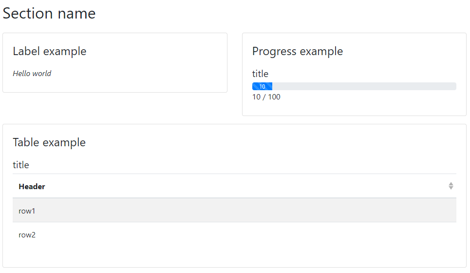

# Spring Boot Metric Dashboard

## Overview

### Description 
This project creates customizable dashboard with metrics.

It's compatible with Spring Boot 2.6 and Java 11+.

### Why
If you have no opportunities/time/resources to configure
external ELK, Prometheus, ... storages and
Kibana, Grafana, ... dashboards
then this project is for you.

### How it works
Spring Boot Actuator provides and configures metrics for cache, http, jdbc, ...
You may configure your own meters as usual.

This project exposes additional management endpoint with dashboard in JSON format, which you may customize.
It also provides small html file to show it in a good way.

Dashboard has:
- metrics
  
- health check information
  
- threaddump information
  

## How to use

You may find completed example [here](/example).

### First steps

First you need to include dependency:

```xml

<dependency>
  <groupId>com.github.ricorodriges.metricuicom.github.ricorodriges.metricui</groupId>
  <artifactId>spring-boot-metric-dashboard</artifactId>
  <scope>runtime</scope>
</dependency>
```

And add into you `application.properties` file:
```properties
management.endpoints.web.exposure.include=health,threaddump,metricView
metricui.enabled=true
```

And that's enough. [http://localhost:8080/metrics](http://localhost:8080/metrics) has predefined beautiful dashboard.

### Properties

All available properties are:
```properties
# /metric endpoint is disabled by default
metricui.enabled=true

# /metric path may be changed
metricui.path=/custom-metrics-path

# project detects actuator /metricView path itself, if you don't define custom management port
metricui.actuator-path=https://my-website.com:8081/management/actuator
#management.server.port=8081
#management.server.base-path=/management
#management.endpoints.web.base-path=/actuator

# and do not forget to enable /metricView management endpoint
# /metric dashboard also requires /health. /threaddump is optional 
management.endpoints.web.exposure.include=health,threaddump,metricView
```

### Measure method

Micrometer provides `@Counted` and `@Timed` metrics. Everything what you need is:

```java
@Service
class SomeService {
    @Counted // register call count
    public void someQuickWork() {
    }

    @Timed // register call count + durations
    public void someHardWork() {
    }
}
```

### Customize dashboard

Auto configuration classes creates `DefaultMetricViewResolver` bean for you.
It already supports many default meters.

If you still want to create your own dashboard you should define `MetricViewResolver` bean:

```java
@Component
public class CustomMetricViewResolver implements MetricViewResolver {
    @Override
    public List<Section> resolveViews(Collection<MeterData> meters) {
        // Use `meters` to extract meter data 
        return List.of(new Section("Section name", List.of(
                new SubSection(
                        "Label example", List.of(new LabelMetricView("<i>Hello world</i>", true)), Width.HALF
                ),
                new SubSection(
                        "Progress example", List.of(new ProgressMetricView("title", 100, 10, "10 / 100")), Width.HALF
                ),
                new SubSection(
                        "Table example",
                        List.of(new TableMetricView("title", List.of("Header"), List.of(List.of("row1"), List.of("row2")))),
                        Width.ROW
                )
        )));
    }
}
```

