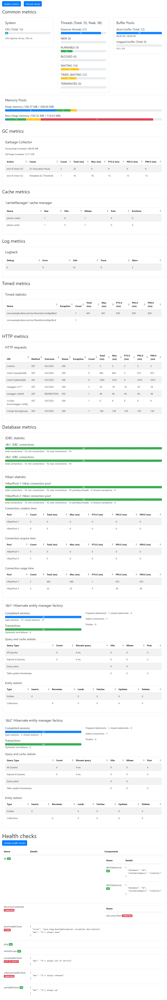

# Example

This example has:
- several custom health checks in `com.example.demo.config.healthcheck` package.
- two `h2` in-memory SQL databases. Spring provides metrics for 2 `DataSource` + Hikari meters.
- `caffeine` caches. Caffeine requires enabling statistic manually. See `CacheConfig`
- `openfeign` REST clients, which queries [The Star Wars API](https://swapi.dev)
- dummy service with `@Counted` and `@Timed` annotations
- `MetricsConfig` configures additional custom section on dashboard

Swagger UI is available on [localhost:8080/base/swagger-ui.html](http://localhost:8080/base/swagger-ui.html)

Dashboard is available on [localhost:8080/base/metrics](http://localhost:8080/base/metrics)

Whole metric page example:

